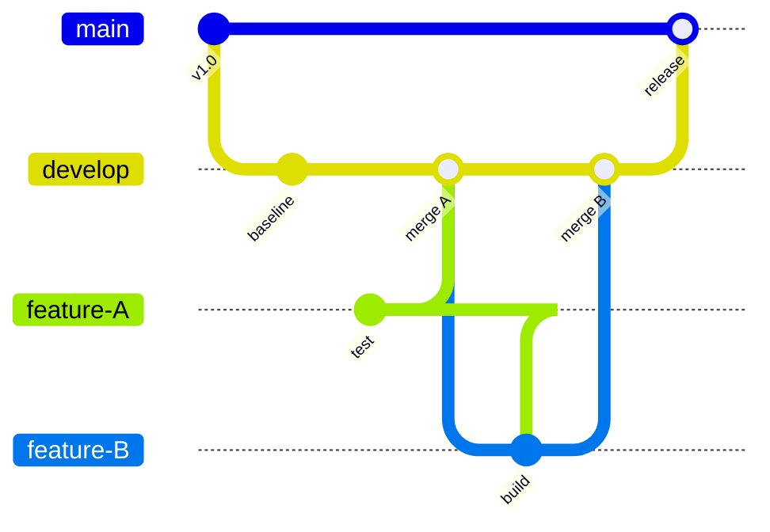
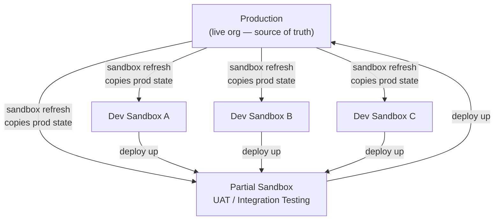
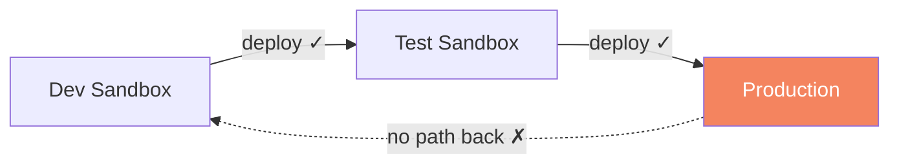

# Why This Difference Matters

The previous two articles established that Git and Salesforce track different kinds of things, and were built for different audiences. Those are the surface differences. Underneath them is a structural gap that makes standard Git workflows fail in Salesforce, and it's easiest to see by drawing the two systems side by side.

## The shape of Git

In Git, work starts from a shared center and branches outward. Developers create feature branches, isolated copies where they can build without affecting anyone else. When the work is ready, it merges back in. The main line stays stable. Everything flows inward.

Branches are cheap, fast, and disposable. You can create a hundred of them. The central repository is the source of truth. Everything converges back to it.

## The shape of Salesforce

Salesforce works the opposite way.

Production is at the top: it's the live system, the one that actually runs your business. Every other environment (sandbox) is a copy of production, created by a "refresh" that snapshots the production org at a point in time. Dev sandboxes, test sandboxes, and partial sandboxes all flow downward from production.

Code promotion still travels upward, from dev to test to production, just like in Git. But the starting point of every environment comes from the top, not the bottom. The shapes are inverted.


**The directions are inverted.** In Git, the repository is the starting point and production is the destination. In Salesforce, production is the starting point and sandboxes are copies of it. Standard Git workflows were designed for the first model, which is why they create predictable problems when applied to the second.


## The road only goes one way

Here is where the practical problem begins.

In Git, the central repository is always authoritative. Whatever is in main is the truth, and any branch can be synced to it at any time.

In Salesforce, production is the live system, and production changes constantly. An admin can update a field, a flow, or a validation rule directly in production, without touching any pipeline or repository. That change exists in the org, but it does not exist anywhere else.

When that happens, every sandbox below it is now out of date. And there is no automatic mechanism to push that production change back down.

This is the back-sync gap. Features travel up to production just fine. But what production contains, especially the direct changes admins make to the live system, has nowhere to go. Every sandbox continues working against a version of reality that's already stale.

## The drift problem

From the moment a sandbox is created, it starts diverging from everything else.

The dev team makes changes in Sandbox A. The QA team makes changes in Sandbox B. An admin changes something directly in production. A week later, no two environments contain the same metadata. Some of those differences are intentional. Most are invisible.

This is drift, and it compounds with every release. Each deployment isn't just moving the new feature forward. It's navigating the accumulated gap between what the sandbox contains and what the target org actually looks like today.

You might be thinking: "Okay, they're different. Can't we find workarounds?"

People try. The rest of this course is the story of what happens when they do.

Each of the next seven topics is a place where the difference between these two systems stops being an inconvenience and becomes a real failure: a deployment that breaks production, a rollback that takes hours, a compliance gap that shows up in an audit, a team that stops trusting its own release process.

Understanding the root cause is what makes those failures legible. Without it, each problem looks like a one-off incident, a configuration error, or a team mistake. With it, they all make sense as predictable consequences of applying the wrong tool to the wrong system.

Now let's walk into it.
