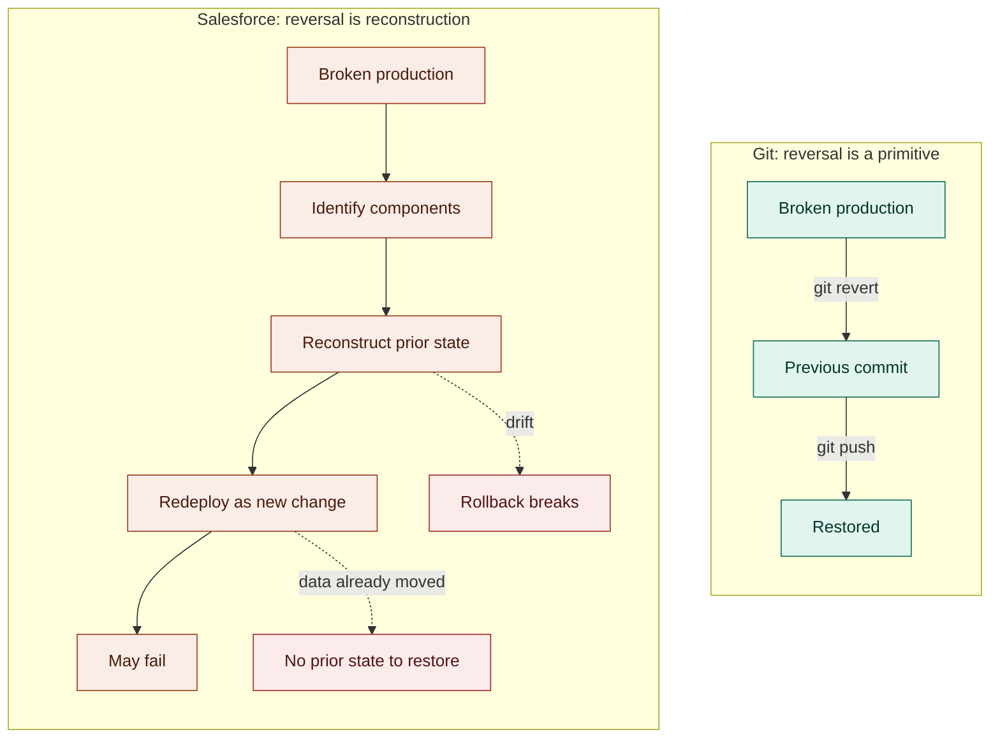

# Mismatch 6: No Rollback

In Git, rolling back a bad deployment takes seconds. You find the commit before the problem, revert to it, and push. Done. The system was designed for this. Reversing a change is as cheap and safe as making one.

In Salesforce, there is no rollback.

Git is Control-Z: instant, reliable, predictable. Salesforce is "rebuild the sandcastle from memory," while the tide is coming in.

Here's what actually happens when a deployment breaks production in a Salesforce org. You identify the components that need to be reverted. You retrieve what those components looked like in the previous state: from a backup, if you have one; from a sandbox, if it hasn't drifted; from memory, if that's all you have. You redeploy the previous configuration as a new deployment, which is subject to the same validation rules and transaction semantics that caused the original problem. If anything in the org has changed in the meantime (and in production, things are always changing), the "rollback" may fail too.

This isn't a gap that process discipline closes. It's an architectural property of the platform. Salesforce deployments are transactions against a live state machine. That state machine doesn't have an undo primitive. The only way back is forward, through a new deployment that restores the prior configuration.

There is an even harder case. Some production changes have no recovery path at all. When data has already moved against a new configuration, or when the platform cannot reverse an operation by design, there is no prior state to restore. The sandcastle isn't just hard to rebuild. The tide already came in.


The cost of rollback in Salesforce isn't just recovery time. It's the business impact of the hours production is degraded or unavailable while reconstruction happens manually. For organizations running on Salesforce, a broken deployment affects every user on the platform in real time.


The absence of native rollback is one of the primary reasons pre-deployment validation matters so much in Salesforce. You can't easily undo a bad deploy, so you have to know before you deploy whether it will succeed. A tooling approach that validates changes against actual org state before they go out addresses the problem at the source. One that doesn't puts the burden of recovery on the team: in production, under pressure, without a reliable path back.
