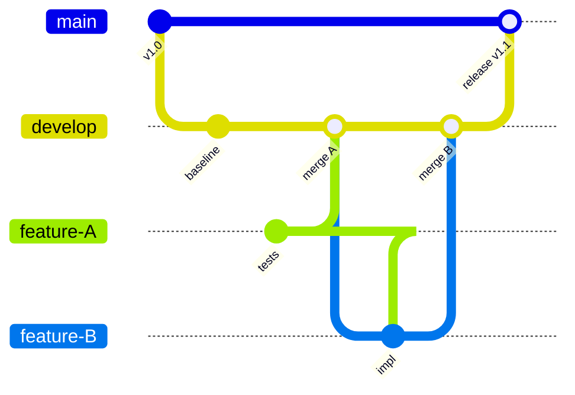
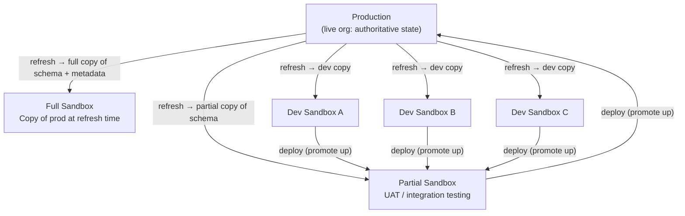
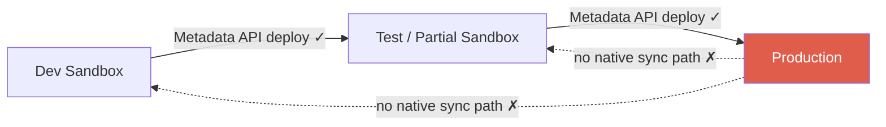
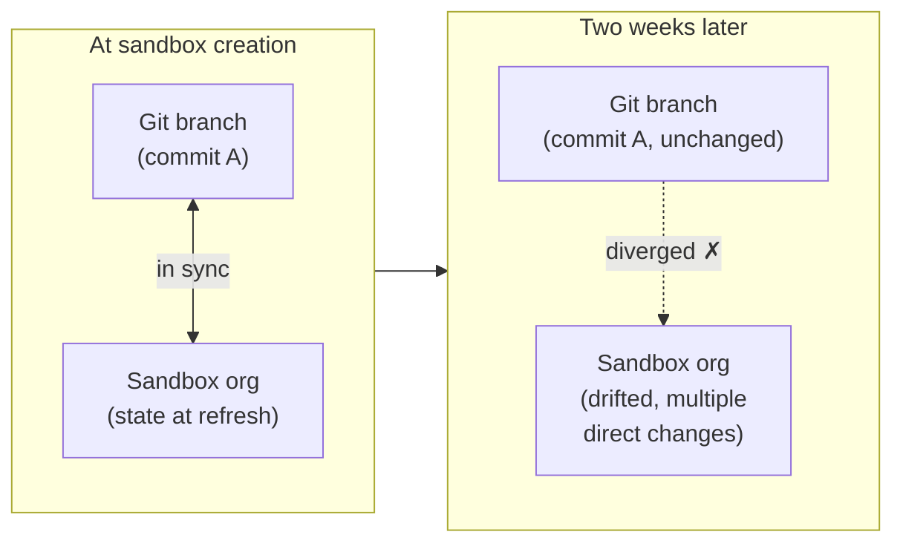

# Why This Difference Matters

This Lesson has established two things.

The first is technical: Git and Salesforce operate on fundamentally different models. Git is a content-addressed file tracking system that treats changes as byte-level operations. Salesforce is a semantically-addressed, live deployed system whose state exists in the org and is only partially approximated by the XML that the Metadata API returns. The repository is never a complete or authoritative representation of the org.

The second is organizational: Git and Salesforce were designed for different users. Git assumes developers working in source code who are fluent with version control abstractions. Salesforce was designed to be accessible to admins and business users without developer mediation. Imposing Git on that audience inverts the platform's value proposition, introduces a mandatory translation layer, and creates the conditions for out-of-band production changes.

These are architectural properties of both systems. They don't change based on team discipline, pipeline sophistication, or tooling configuration. Three concrete consequences follow directly from them.

## 1. Topology inversion

Git and Salesforce have inverted hierarchical topologies. Understanding this precisely explains why standard branching strategies fail structurally, not operationally.

**In Git**, the repository is the root. The commit graph descends from main. Feature branches diverge from a shared baseline and merge back in. Every environment is a checkout of the same commit graph: semantically identical, reconstructible, interchangeable. The source of truth is the repository.

**In Salesforce**, production is the root. Every sandbox is created by refreshing from a parent org, typically production or a full/partial sandbox that was itself refreshed from production. The environment hierarchy flows downward from the live system. The source of truth is the org.

Code promotion travels upward (dev → partial → production), the same direction as in Git. But the environment hierarchy is inverted: sandboxes are downstream of production, not peers of it. Any branching strategy that assumes Git's topology (environments as interchangeable checkouts of a shared baseline) will conflict with Salesforce's topology (environments as time-delayed copies of a live system) at the architectural level.

## 2. The absent back-sync path

The topology inversion creates a second problem: there is no native mechanism to propagate production state back to downstream sandboxes.

In Git, syncing a branch to main is a fetch and merge: a first-class operation. Any branch can be brought current with the source of truth at any time with guaranteed reproducibility.

In Salesforce, the equivalent operation does not exist natively. When an admin changes production directly, outside any pipeline, that change exists only in the production org. The Metadata API can retrieve it as a point-in-time snapshot. But there is no native command that takes a production change and propagates it forward to all sandboxes.

The practical consequence: every sandbox accumulates drift from production from the moment it is refreshed. The only way to fully reset a sandbox to current production state is a sandbox refresh, a destructive operation that overwrites all sandbox-specific work and may take hours. Teams work around this with manual metadata retrieval and selective deployments, but both approaches are error-prone and scale poorly.

The back-sync gap is not a workflow deficiency. It is an architectural property of a system where the org is the source of truth and Git is an external observer.

## 3. Branch-org divergence at rest

The third consequence is the most operationally damaging: org state and repository state diverge continuously, and the divergence is not detectable from inside Git.

In a standard Git workflow, a branch that hasn't been touched in two weeks is still synchronized with its last commit. Nothing in the repository changes unless someone commits a change.

In Salesforce, the equivalent sandbox can drift significantly over the same two weeks without any pipeline activity:

* Admins make configuration changes directly in the org
* Automated processes (scheduled flows, batch jobs) modify records and configuration
* Other deployments land in the same org and change the dependency graph
* The sandbox may have been refreshed, resetting it to a different point-in-time snapshot of production

Git has no awareness of what happened in the org. `git status` shows a clean working tree. The branch is "up to date." From Git's perspective, nothing changed. From the org's perspective, the branch is now a stale record of a state that no longer exists.

This divergence is the origin of every failure mode in Lesson 3. It is not caused by process failures or team errors. It is caused by the structural property that admins and automated systems can modify org state outside any version control boundary, and that Git has no mechanism to observe or reconcile this.

## What comes next

Lesson 3 examines those failure modes in detail. Each of the seven mismatches is a direct consequence of the properties established here:

* The content-vs-semantic gap produces failures in merge and deployment (Mismatches 1, 3, 5)
* The org-as-source-of-truth problem produces drift and audit failures (Mismatches 2, 7)
* The topology inversion undermines branching strategies and makes rollback structurally unavailable (Mismatches 4, 6)

If the architectural model in this Lesson is clear, Lesson 3 should read as consequences unfolding from a known cause. If anything here is still unclear, this is the right place to reread before proceeding. Lesson 3 builds directly on this foundation.
